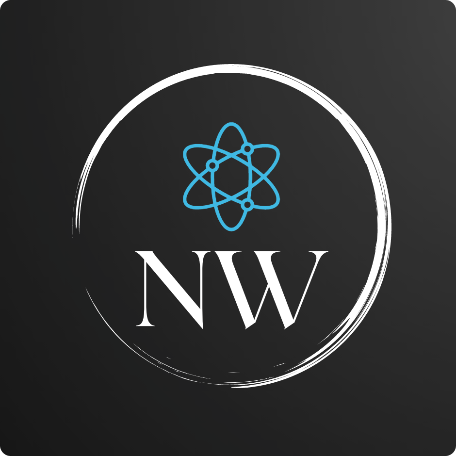

<!-- PROJECT SHIELDS -->
<!--
Here's a blank template to get started:
**To avoid retyping too much info. Do a search and replace with your text editor for the following:**
`navigation-animation`
-->
[![Contributors][contributors-shield]][contributors-url]
[![Forks][forks-shield]][forks-url]
[![Stargazers][stars-shield]][stars-url]
[![Issues][issues-shield]][issues-url]
[![MIT License][license-shield]][license-url]
[![LinkedIn][linkedin-shield]][linkedin-url]

<!-- PROJECT LOGO -->
 

  

  <h3 align="center">Navigation Animation</h3>

  

    Front end project. My take on a navbar with animations.
     
    <a href="https://njaalwiik.github.io/navigation-animation" target="_blank"><strong>View Demo »</strong></a>
     
     
    <a href="https://njaalwiik.github.io/navigation-animation">Explore The Docs</a>
    ·
    <a href="https://github.com/NjaalWiik/navigation-animation/issues">Report Bug</a>
    ·
    <a href="https://github.com/NjaalWiik/navigation-animation/issues">Request Feature</a>
  

<!-- TABLE OF CONTENTS -->
## Table of Contents

- [Table of Contents](#table-of-contents)
- [About The Project](#about-the-project)
  - [Built With](#built-with)
- [Usage](#usage)
- [Roadmap](#roadmap)
- [Contributing](#contributing)
- [License](#license)
- [Contact](#contact)

<!-- ABOUT THE PROJECT -->
## About The Project

[![Product Name Screen Shot][product-screenshot]](https://github.com/NjaalWiik/navigation-animation/blob/master/images/demo.png?raw=true)

### Built With

* 

<!-- USAGE EXAMPLES -->
## Usage

Use this space to show useful examples of how a project can be used. Additional screenshots, code examples and demos work well in this space. You may also link to more resources.

<!-- ROADMAP -->
## Roadmap

See the [open issues](https://github.com/NjaalWiik/navigation-animation/issues) for a list of proposed features (and known issues).

<!-- CONTRIBUTING -->
## Contributing

Contributions are what make the open source community such an amazing place to be learn, inspire, and create. Any contributions you make are **greatly appreciated**.

1. Fork the Project
2. Create your Feature Branch (`git checkout -b feature/AmazingFeature`)
3. Commit your Changes (`git commit -m 'Add some AmazingFeature'`)
4. Push to the Branch (`git push origin feature/AmazingFeature`)
5. Open a Pull Request

<!-- LICENSE -->
## License

Distributed under the MIT License. See `LICENSE` for more information.

<!-- CONTACT -->
## Contact

Njål Wiik - [@linkedin-url](https://www.linkedin.com/in/njaal-wiik/)

Project Link: [https://github.com/NjaalWiik/navigation-animation](https://github.com/NjaalWiik/navigation-animation)

<!-- MARKDOWN LINKS & IMAGES -->
<!-- https://www.markdownguide.org/basic-syntax/#reference-style-links -->
[contributors-shield]: https://img.shields.io/github/contributors/NjaalWiik/repo.svg?style=flat-square
[contributors-url]: https://github.com/NjaalWiik/repo/graphs/contributors
[forks-shield]: https://img.shields.io/github/forks/NjaalWiik/repo.svg?style=flat-square
[forks-url]: https://github.com/NjaalWiik/repo/network/members
[stars-shield]: https://img.shields.io/github/stars/NjaalWiik/repo.svg?style=flat-square
[stars-url]: https://github.com/NjaalWiik/repo/stargazers
[issues-shield]: https://img.shields.io/github/issues/NjaalWiik/repo.svg?style=flat-square
[issues-url]: https://github.com/NjaalWiik/repo/issues
[license-shield]: https://img.shields.io/github/license/NjaalWiik/repo.svg?style=flat-square
[license-url]: https://github.com/NjaalWiik/repo/blob/master/LICENSE.txt
[linkedin-shield]: https://img.shields.io/badge/-LinkedIn-black.svg?style=flat-square&logo=linkedin&colorB=555
[linkedin-url]: https://www.linkedin.com/in/njaal-wiik/
[product-screenshot]: https://github.com/NjaalWiik/navigation-animation/blob/master/images/demo.png?raw=true
